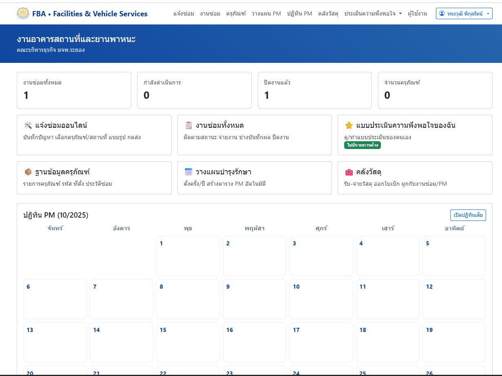
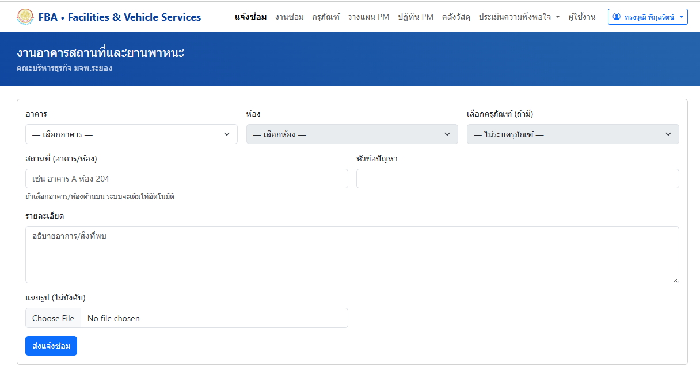
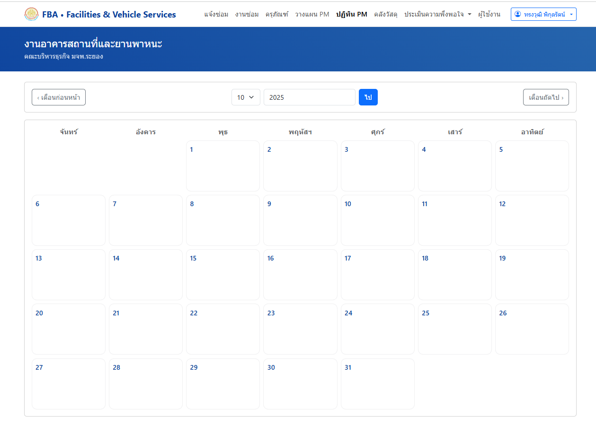

# 🏢 Facility-MMS — ระบบจัดการอาคารและซ่อมบำรุง (Facilities & Maintenance Management System)

ระบบบริหารจัดการงานอาคารสถานที่และยานพาหนะ  
สำหรับหน่วยงานหรือองค์กรที่ต้องการระบบ **แจ้งซ่อมออนไลน์**, **ติดตามงานซ่อม**, และ **จัดตารางบำรุงรักษา (Preventive Maintenance)** แบบครบวงจร  

พัฒนาโดย คณะบริหารธุรกิจ มจพ. ระยอง  
รองรับการใช้งานผ่านเว็บไซต์ภายในองค์กรและการเชื่อมต่อผ่าน LINE OA

---

## 🌐 DEMO / Preview
> 🔗 
---

## 🧩 ฟีเจอร์หลัก

### 🧾 แจ้งซ่อมออนไลน์
- กรอกปัญหา เลือกครุภัณฑ์/สถานที่แนบรูปได้  
- ระบบบันทึกสถานะ “รอตรวจสอบ / กำลังดำเนินการ / ปิดงานแล้ว”  
- แจ้งเตือนผ่าน LINE OA อัตโนมัติ  

### 🧰 งานซ่อมทั้งหมด
- แสดงรายการงานซ่อมพร้อมสถานะ  
- ค้นหา / กรอง / เรียงตามวัน / ประเภทงาน  
- ช่างและผู้ดูแลระบบสามารถอัปเดตสถานะได้  

### 🗂️ ฐานข้อมูลครุภัณฑ์
- เก็บข้อมูลรหัส, หมวดหมู่, ประวัติการซ่อม  
- เชื่อมโยงกับใบแจ้งซ่อมและตาราง PM  

### 🗓️ ตารางบำรุงรักษา (PM)
- สร้างแผน PM อัตโนมัติ (รายเดือน / รายปี)  
- ปฏิทินแสดงงานบำรุงรักษาแบบ Calendar View  
- แจ้งเตือนก่อนถึงรอบบำรุงรักษา  

### 📦 คลังวัสดุ
- รับ–จ่ายวัสดุที่ใช้ในการซ่อม  
- ตัดสต็อกอัตโนมัติเมื่อมีการเบิกของ  

### 💬 แบบประเมินความพึงพอใจ
- ผู้ใช้งานสามารถให้คะแนนความพึงพอใจหลังปิดงาน  
- ผู้ดูแลสามารถสรุปผลเป็นรายเดือน/รายปี  

---

## 🖼️ ตัวอย่างหน้าจอระบบ

| หน้าแดชบอร์ดหลัก | ฟอร์มแจ้งซ่อม | ปฏิทิน PM |
|--------------------|----------------|------------|
|  |  |  |

> ตัวอย่างจากระบบจริงของ “งานอาคารสถานที่และยานพาหนะ”  
> คณะบริหารธุรกิจ มจพ. วิทยาเขตระยอง

---

## ⚙️ เทคโนโลยีที่ใช้

| ส่วนระบบ | เทคโนโลยี |
|-----------|------------|
| Backend | PHP 8.x (PDO / MVC), MySQL |
| Frontend | HTML5, Bootstrap 5, JavaScript |
| Authentication | ICIT SSO / LINE Login |
| Notification | LINE Messaging API |
| PDF Export | mPDF |
| Hosting | XAMPP / InfinityFree / VPS |

---

## 🧭 โครงสร้างโปรเจกต์ <br>

facility-mms/ <br>
├── inc/ # Config, DB connection, Helper functions <br>
├── public/ # หน้า UI สำหรับผู้ใช้งานทั่วไป <br>
├── admin/ # ส่วนจัดการของผู้ดูแลระบบ <br>
├── assets/ # CSS, JS, รูปภาพ <br>
├── docs/ # Screenshot, คู่มือประกอบ <br>
├── db/ # ไฟล์ฐานข้อมูล (.sql) <br>
└── README.md <br>

## 🚀 วิธีติดตั้ง

1. **Clone โปรเจกต์**
   ```bash
   git clone https://github.com/USERNAME/facility-mms.git
   cd facility-mms

2. ตั้งค่า Database
สร้างฐานข้อมูลใหม่ใน phpMyAdmin
Import ไฟล์ db/facility_mms.sql
แก้ไข inc/config.php ให้ตรงกับเครื่องของคุณ

3. เปิดระบบผ่านเบราว์เซอร์ http://localhost/facility-mms/public/
   
👩‍💻 ผู้พัฒนา
Oat — วิศวกรไฟฟ้า / โปรแกรมเมอร์ คณะบริหารธุรกิจ มจพ. ระยอง <br>
💼 Full-stack Developer (PHP, MySQL, Bootstrap) <br>
⚙️ Electrical Engineer & System Integrator <br>
💡 สนใจ Business Systems, SaaS, Automation <br>
📧 ติดต่อผ่าน LINE OA หรืออีเมล <br>

📄 License <br>
Distributed under the MIT License. <br>
See LICENSE for more information. <br>

💬 หมายเหตุเพิ่มเติม <br>
ระบบนี้ออกแบบให้ปรับแต่งได้ตามองค์กร <br>
รองรับการต่อยอดเป็น SaaS สำหรับหน่วยงาน, โรงเรียน, โรงงาน หรือมหาวิทยาลัย <br>

⭐ ถ้าชอบระบบนี้ <br>
กด ⭐ ที่ repo เพื่อเป็นกำลังใจให้ผู้พัฒนา ❤️
